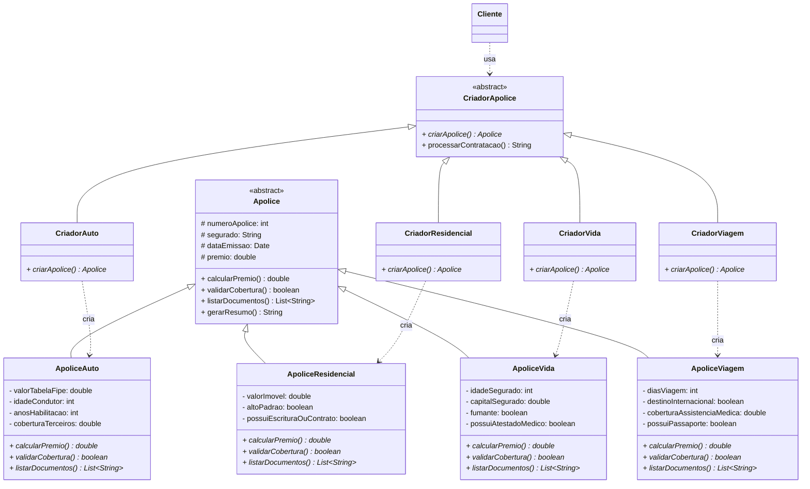

```mermaid
    classDiagram
    direction TB

    class Pedido {
        -double valorBase
        -String estadoOrigem
        -String estadoDestino
        -String cepDestino
        -boolean produtoEssencial
        -String opcaoPagamentoLocal
        +getters()
    }

    class Checkout {
        -CheckoutFactory factory
        +Checkout(CheckoutFactory factory)
        +finalizarPedido(Pedido pedido)
    }

    %% Interfaces Abstract Factory e Produtos
    class CheckoutFactory {
        <<interface>>
        +criarDocumentoFiscal() DocumentoFiscal
        +criarProcessadorPagamento() ProcessadorPagamento
        +criarEtiquetaEnvio() EtiquetaEnvio
    }

    class DocumentoFiscal {
        <<interface>>
        +gerar(Pedido pedido) String
    }

    class ProcessadorPagamento {
        <<interface>>
        +processar(Pedido pedido) String
    }

    class EtiquetaEnvio {
        <<interface>>
        +gerarEtiqueta(Pedido pedido) String
    }

    %% Dependências do Cliente
    Checkout --> CheckoutFactory : utiliza
    Checkout --> DocumentoFiscal : utiliza
    Checkout --> ProcessadorPagamento : utiliza
    Checkout --> EtiquetaEnvio : utiliza
    Checkout ..> Pedido

    %% Fábricas Concretas
    class BrasilFactory {
        +criarDocumentoFiscal() DocumentoFiscal
        +criarProcessadorPagamento() ProcessadorPagamento
        +criarEtiquetaEnvio() EtiquetaEnvio
    }
    
    class USAFactory {
        +criarDocumentoFiscal() DocumentoFiscal
        +criarProcessadorPagamento() ProcessadorPagamento
        +criarEtiquetaEnvio() EtiquetaEnvio
    }
    
    class AlemanhaFactory {
        +criarDocumentoFiscal() DocumentoFiscal
        +criarProcessadorPagamento() ProcessadorPagamento
        +criarEtiquetaEnvio() EtiquetaEnvio
    }

    CheckoutFactory <|.. BrasilFactory
    CheckoutFactory <|.. USAFactory
    CheckoutFactory <|.. AlemanhaFactory

    %% Produtos Concretos - Brasil
    class NFe { +gerar(Pedido) String }
    class PagamentoPixBoleto { +processar(Pedido) String }
    class EtiquetaCorreios { +gerarEtiqueta(Pedido) String }
    
    DocumentoFiscal <|.. NFe
    ProcessadorPagamento <|.. PagamentoPixBoleto
    EtiquetaEnvio <|.. EtiquetaCorreios

    %% Produtos Concretos - EUA
    class SalesInvoice { +gerar(Pedido) String }
    class PagamentoCartaoCredito { +processar(Pedido) String }
    class EtiquetaUSPS { +gerarEtiqueta(Pedido) String }

    DocumentoFiscal <|.. SalesInvoice
    ProcessadorPagamento <|.. PagamentoCartaoCredito
    EtiquetaEnvio <|.. EtiquetaUSPS

    %% Produtos Concretos - Alemanha
    class VATInvoice { +gerar(Pedido) String }
    class PagamentoSEPADirectDebit { +processar(Pedido) String }
    class EtiquetaDeutschePost { +gerarEtiqueta(Pedido) String }

    DocumentoFiscal <|.. VATInvoice
    ProcessadorPagamento <|.. PagamentoSEPADirectDebit
    EtiquetaEnvio <|.. EtiquetaDeutschePost
```

# Design Patterns em Java — Padrões Criacionais

Repositório dedicado à resolução de exercícios práticos de engenharia de software focados em Padrões de Projeto (Design Patterns) da arquitetura GoF (Gang of Four), utilizando Java.

## Exercício 1: Sistema de Emissão de Apólices (Factory Method)

### Contexto

Sistema desenvolvido para substituir condicionais complexas em uma seguradora, suportando quatro linhas de produto iniciais e permitindo a inclusão de novas linhas futuras sem alterar código existente (`RNF01`).

### Regras de Negócio e Coberturas Implementadas

- **RF01 (Apólice Auto):** Prêmio base de 8% da tabela FIPE/12. Acréscimo de 30% se < 25 anos e 20% se habilitação < 2 anos. Exigência mínima de R$ 50.000,00 contra terceiros. Docs: CNH, CRLV, Comprovante de Residência.
- **RF02 (Apólice Residencial):** Prêmio base de 1,5% do valor ao ano/12. Acréscimo de 25% para imóveis de alto padrão. Exigência de escritura ou contrato de locação. Docs: Escritura/Contrato, Comprovante de Residência.
- **RF03 (Apólice Vida):** Prêmio calculado por $(\text{idade} \times 12) + (\text{capital segurado} \times 0,002)$. Acréscimo de 50% para fumantes. Exigência de atestado médico se capital > R$ 500.000,00. Docs: RG, CPF, Atestado Médico (quando aplicável).
- **RF04 (Apólice Viagem):** Prêmio calculado por $\text{dias} \times \text{RS } 15,00$ (+ R$ 100,00 se internacional). Exigência de assistência médica $\ge \text{US } 30.000,00$ e passaporte para viagens internacionais. Docs: Itinerário, Passaporte (quando aplicável).

### Diagrama de Classes

## Exercício 2: Checkout Internacional de Marketplace (Abstract Factory)

### Contexto

Sistema de checkout para expansão internacional (Brasil, Estados Unidos e Alemanha). O requisito crítico de compliance impede a mistura de artefatos de países diferentes em um mesmo pedido.

### Regras de Negócio e Artefatos por País

- **Brasil (BR):** Nota Fiscal Eletrônica (CFOP, ICMS, chave 44 dígitos), Pagamento via Pix (com desconto) ou Boleto, Etiqueta Correios (`00000-000`).
- **Estados Unidos (US):** Sales Invoice (Sales tax por estado, EIN), Pagamento por Cartão de Crédito com verificação AVS, Etiqueta USPS (`ZIP+4`).
- **Alemanha (DE):** VAT Invoice (Umsatzsteuer, VAT-ID), Pagamento por SEPA Direct Debit, Etiqueta Deutsche Post (`PLZ` de 5 dígitos).

### Tecnologias Utilizadas

- **Java** (JDK 26)
- **Orientação a Objetos Avançada** (Polimorfismo, Classes Abstratas, Interfaces)
- Princípios **SOLID**

### Diagrama de Classes

